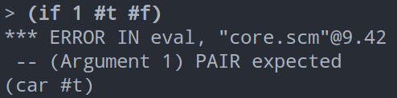

## 遇到一个问题


因为#t和#f既不是self-evaluating?也不是variable?。

当前系统还不支持#t和#f这两个关键字，但是为了兼容gambit（gambit没有true和false关键字），我加了这两行。


这导致了上面的问题。

## 解决办法

修改self-evaluating？函数：

```scheme
(define (self-evaluating? exp)
  (cond ((number? exp) true)
        ((string? exp) true)
        ((eq? exp '#t) true)
        ((eq? exp '#f) true)
        (else false)))
```
