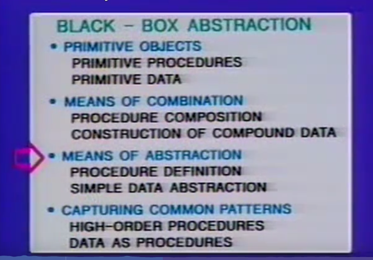
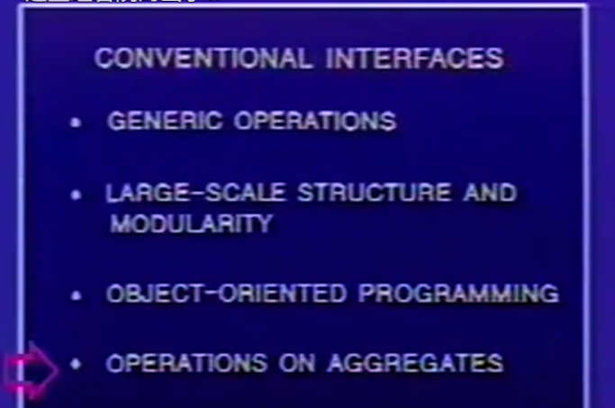
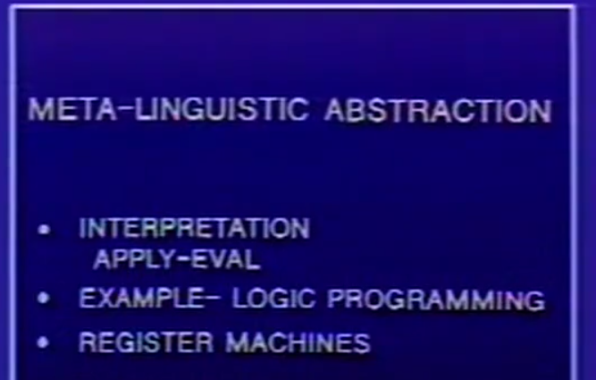
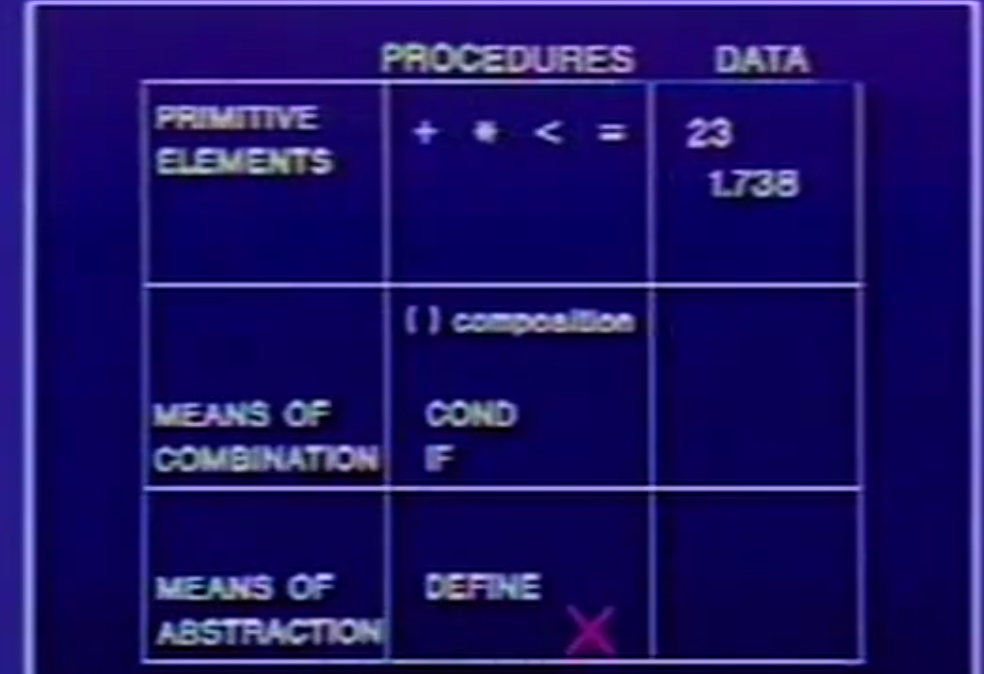

# chapter 1

1. The essence of Computer Science

   How to formalize intuitions about PROCESS. 

   geometry: declarative knowledge, CS: imperative knowledge

   PROCESS PROCEDURE

   LISP

2. TECHNIQUES for CONTROLLING the COMPLEXITY

   * BLACK-BOX ABSTRACTION

     

   * CONVENTIONAL INTERFACES

     

   * METALINGUISTIC ABSTRACTION 

     

3. LISP
   * PRIMITIVE ELEMENTS
   
   * MEANS OF COMBINATION
   
   * MEANS OF ABSTRACTION
   
     
   
     
   
     [DrRacket 的安装与 SICP 的配置](https://zhuanlan.zhihu.com/p/37056659)
   
     [Yet Another Scheme 入门教程](https://www.w3cschool.cn/yast_cn/)
   
     

